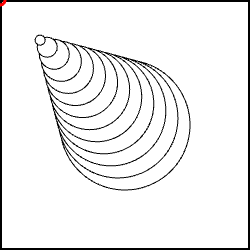
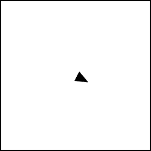

# Vectores.

_Instrucciones_:

Resuelve las siguientes dinamicas usando vectores. Sube el resultado en una carpeta separada para cada sketch.

**Vectores**

Todas las respuestas de estas preguntas deben ir en una carpeta llamada `vectores`.

1. Construye un sketch que tenga el siguiente comportamiento:
   1. Una serie de círculos de grandes a pequeños, que se aproximan al mouse.
   2. Los más grandes lo siguen de manera menor que los pequeños.
   3. Debes usar elementos de la clase PVector`.
   4. _Hint: Usa la operación_ `.mult()` _con varios escalares para cada círculo._
   5. A continuación se pone un ejemplo de cómo se debería de ver. El mouse está indicado con un círculo rojo. 
   
   

2. Basándote en el sketch `vectors\SpaceshipVectors` haz lo siguiente:
   1. Modifica la función `render` para dibujar una nave espacial diseñada por ti. Debe tener al menos 3 elementos extras.
   2. Debes usar operaciones con vectores para dibujar la nave espacial.
   3. Se debe poder controlar la rapidez de la nave espacial con las teclas arriba y abajo. _Hint: recuerda que la rapidez es la magnitud de la velocidad_.
   4. A continuación se pone un ejemplo de cómo se debería de ver.
   
   
3. Construye un sketch que tenga contenga lo siguiente:
   1. Una clase `Spaceship` que represente a una nave espacial. Debe tener el mismo comportamiento que lo mostrado en el sketch `vectors\SpaceshipVectors`.
   2. Una clase `Planet` que represente a un planeta. Debe guardar atributos para parametrizar su dibujo. Trata de añadarle también movimiento.
   3. En el sketch principal crea dos objetos de tipo `Spaceship`. El primero debe tener una aceleración aleatoria, el segundo debe modificiar su aceleración para seguir al mouse.
   4. En el sketch principal crea tres objetos de tipo `Planet` y desplegarlos en el canvas. Arma una escena galáctica ;).

4. Lleva la dinamica de la pelota que rebota a 3D. Usando vectores en tres dimensiones, haz una esfera que rebote dentro de una caja (cubo). Define la velocidad y posicion como un vectores.
5. Actualiza el sketch de las lineas hecho en clase para que tenga un comportamiento similar a: http://www.generative-gestaltung.de/2/sketches/?01_P/P_2_1_5_04. Como puedes ver en este sketch se guarda todo el trazo hecho por el usuario.

No olvides que para responder cualquier duda que tengas debes levantar un issue.

Happy hacking! :D
